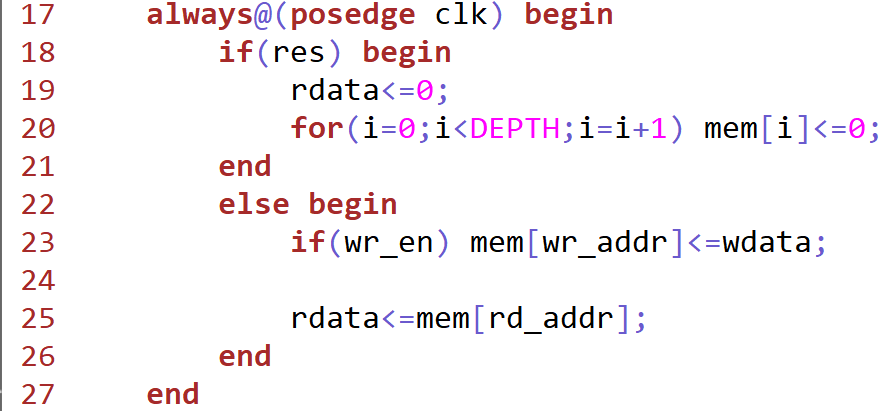
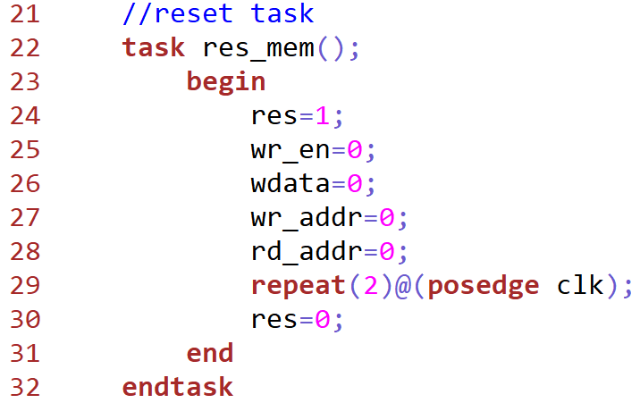
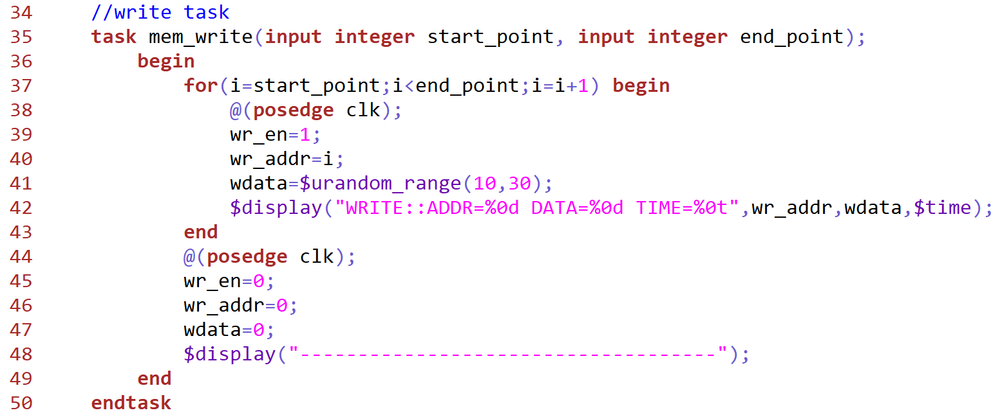
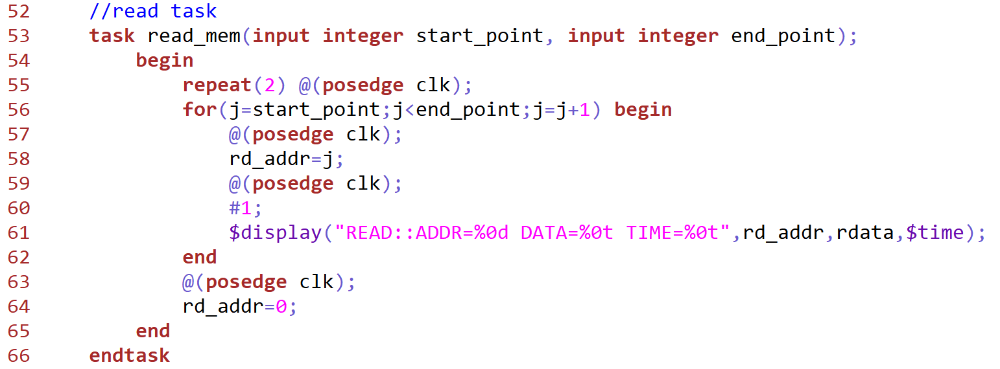
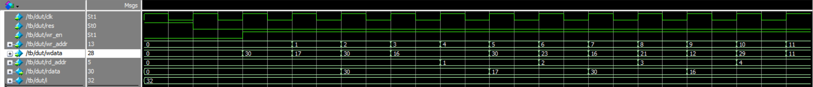

# Dual-Port-RAM-Verilog
Parameterized Dual-Port RAM Design and Verification using Verilog HDL

## Project Overview

This project implements a Parameterized Dual-Port RAM using Verilog HDL.

## Features

* Synchronous Read
* Synchronous Write
* Independent Read and Write Ports
* Simultaneous Read and Write Operations
* Memory Reset
* Parameterized Design

## Directory Structure

```text
rtl/
tb/
waveforms/
docs/
```

## RTL Design

Dual-Port RAM uses separate address ports for read and write operations, allowing both operations to occur simultaneously.

## Verification

The testbench includes:

* Reset Task
* Write Task
* Read Task

Random data is written into memory and read back for verification.

## Simulation Results

Waveforms demonstrate successful simultaneous read and write operations along with correct memory functionality.

## Author

Yaswanth Reddy

## RTL Design



## Reset Task



## Write Task



## Read Task



## Simulation Waveforms


